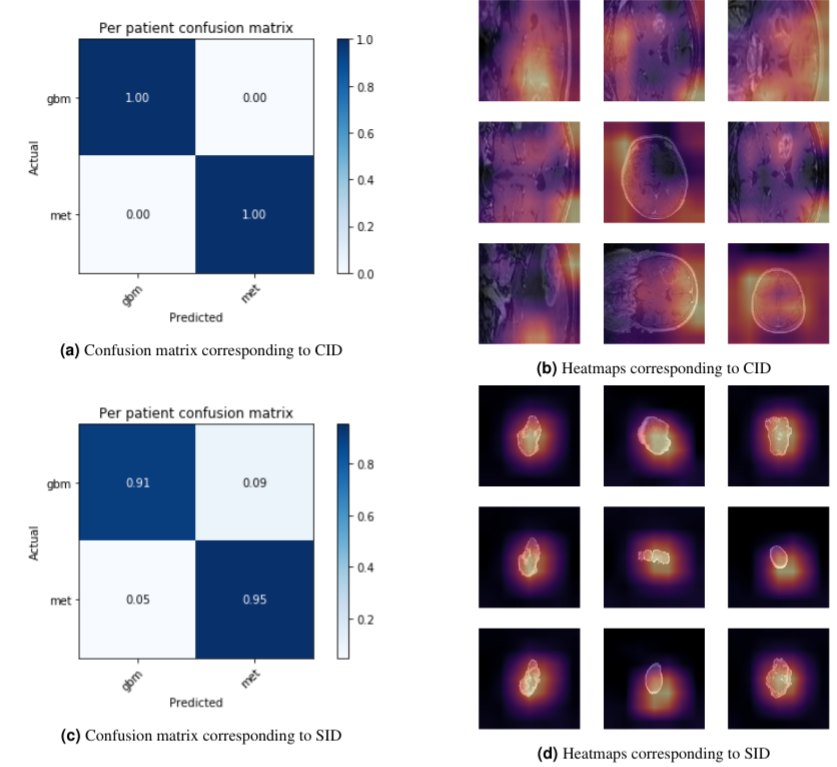
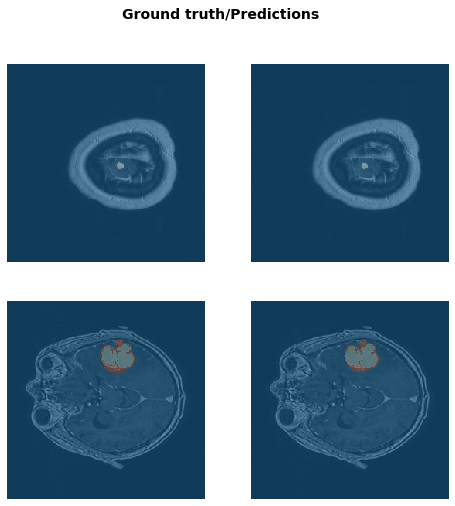

# MoLAB research projects

Deep Learning applications to medical imaging related to brain oncology.

## Glioblastoma VS Brain metastasis MRI classification
Glioblastoma is the most widespread and very aggressive brain tumor. Brain metastasis are very common also and looks similar to glioblastoma. Treatment vary significantly depending on the diagnosis. Therefore efficient and robust image classifier is in high need.

Common scenario of Deep Learning application to healthcare domain is brilliant performance in retrospective study and terrible one in real life environment. In this project it was shown that:

* while appropriate pre-processing may reduce accuracy it provides better generalization on data from unseen hospitals/MRI scanners.

* this is general behavior for deep learning models, not for specific architecture (ResNets, DenseNet121 and VGG19 were considered)

|          |preprocessing|no preprocessing|
|:---:|:---:|:---:|
| ResNet34 |0.823357|0.991495|
| ResNet50 |0.839090|0.993298|
|ResNet101|0.824393|0.993098|
|DenseNet121|0.814449|0.990236|
|VGG19|0.828771|0.990423|

## MRI segmentation

## Data availability

Unfortunately, data is not available for sharing right now.

## License
[MIT](https://choosealicense.com/licenses/mit/)